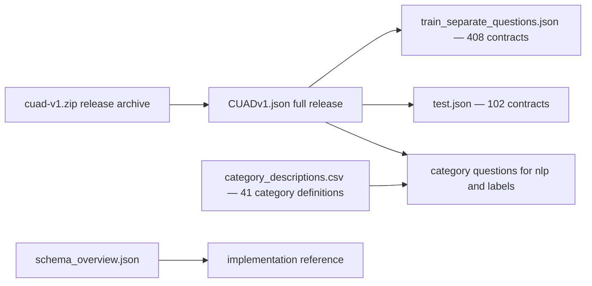

# CUAD data guide

Use this as the practical starting point for the Contract Understanding Atticus
Dataset (CUAD) v1 in this repository. CUAD is a SQuAD style question/answer
dataset: a contract and a category specific question are paired with zero or more
exact evidence spans. A category question is not itself an answer span i.e. list of answers.

## Data File Map 

| File | Use it for |
| --- | --- |
| `CUADv1.json` | Full release: 510 commercial contracts, 41 categories, and 13,823 annotated answer spans. |
| `train_separate_questions.json` | Official training split: 408 contracts. |
| `test.json` | Official test split: 102 contracts. |
| `category_descriptions.csv` | The 41 category names, definitions, expected answer formats, and supplied group codes. |
| `cuad-v1.zip` | Original official `data.zip` release archive; retain as provenance/source artifact. |
| `schema_overview.json` | Repository JSON schema and statistics overview. |
| `README.md` | Dataset provenance, release links, license, and archive checksum. |



All three JSON files use the same schema. The official contract level splits are
non overlapping: 408 train + 102 test = 510 contracts. *(80/20 split)*

## JSON structure
*Descriptions are in the table below this diagram*
```text
file
├── version
└── <array>data[]
    └── paragraphs[]
        ├── context
        └── <array>qas[]
            ├── id, question, is_impossible
            └── <array>answers[]
                └── text, answer_start
```
In compact form: `file → data[] → paragraphs[] → qas[] → answers[]`.
`paragraphs[]` is where the contract lives ('text and annotation' container); in this release each contract
has one long context entry. `title` is the contract level id, so we can use it to
compare split membership.

| Field | Type | Meaning | Example |
| --- | --- | --- | --- |
| `version` | string | Dataset format/version id. | `aok_v1.0` |
| `title` | string | Contract identifier/title at `data[]`. | `LIMEENERGYCO_09_09_1999-EX-10-DISTRIBUTOR AGREEMENT` |
| `context` | string | Full contract text containing the evidence. | `This Agreement is made...` |
| `id` | string | Q&A identifier combining contract title and category. | `<title>__Effective Date` |
| `question` | string | Prompt that names the review category and what to find. | `Highlight the parts ... "Effective Date" ...` |
| `is_impossible` | boolean | `false` means at least one evidence span is labeled; `true` means none is labeled. | `false` |
| `answers[].text` | string | Exact selected contract text supporting that category. | `1 August 2011` |
| `answers[].answer_start` | integer | Zero based *(starts from 0)* character position of `text` in its parent `context`. | `430` |

For every answer, the basic integrity check is to use char distance `answer_start` to locate it's position in the context:

```python
context[answer_start : answer_start + len(text)] == text
```

An empty `answers` array is therefore a 'no evidence' label for that Q&A record, not
an empty contract or a missing category definition. A model may use the category
question to classify whether a clause is present; evidence extraction then locates
the supporting text.

## Category metadata

`category_descriptions.csv` is the source for all 41 full definitions and expected
answer formats. It supplies six organizational group codes (not official risk
levels), summarized here with plain language themes inferred from their members:

| Supplied group | Theme | Categories |
| --- | --- | --- |
| 1 | Dates and term | Agreement Date; Effective Date; Expiration Date; Renewal Term; Notice Period to Terminate Renewal |
| 2 | Competitive restrictions | Non-Compete; Exclusivity; No-Solicit of Customers; Competitive Restriction Exception |
| 3 | Control and assignment | Change of Control; Anti-Assignment |
| 4 | Licensing | License Grant; Non-Transferable License; Affiliate License-Licensor; Affiliate License-Licensee; Unlimited/All-You-Can-Eat-License; Irrevocable or Perpetual License |
| 5 | Post-termination and audit | Post-Termination Services; Audit Rights |
| 6 | Liability | Uncapped Liability; Cap on Liability |

The other 20 categories have group `-`: Document Name; Parties; Governing Law; Most
Favored Nation; No-Solicit of Employees; Non-Disparagement; Termination for
Convenience; Rofr/Rofo/Rofn; Revenue/Profit Sharing; Price Restrictions; Minimum
Commitment; Volume Restriction; IP Ownership Assignment; Joint IP Ownership; Source
Code Escrow; Liquidated Damages; Warranty Duration; Insurance; Covenant Not to Sue;
and Third Party Beneficiary.

Group codes are organizational metadata only. CUAD contains **no** Low/Medium/High
risk labels. We'd have to implement this layer later on.

## Worked annotation traces

Each trace below was checked against its parent `context`: slicing at every listed
`answer_start` reproduces the labeled `text` exactly.

### Effective Date — event-based extraction

Path: `data[0].paragraphs[0].qas[3]` in `CUADv1.json`.

`id`: `LIMEENERGYCO_09_09_1999-EX-10-DISTRIBUTOR AGREEMENT__Effective Date`.
`is_impossible`: `false`

| `answer_start` | `answers[].text` |
| ---: | --- |
| 5268 | `The term of this Agreement shall be ten (10) years (the "Term") which shall commence on the date upon which the Company delivers to Distributor the last Sample, as defined hereinafter.` |
| 31058 | `Unless earlier terminated otherwise provided therein, this Agreement, subject to the  commencement date established in Section 1.3, shall be effective immediately.` |

The category asks for the effective date, but the evidence is event based rather
than a calendar date: commencement occurs when the Company delivers the last Sample.
The second example connects that commencement date to when the agreement becomes
effective. Both offsets reproduce their respective text when sliced from `context`.

### Termination for Convenience — implied “Yes”

Path: `data[3].paragraphs[0].qas[15]` in `CUADv1.json`.

`id`: `CENTRACKINTERNATIONALINC_10_29_1999-EX-10.3-WEB SITE HOSTING AGREEMENT__Termination For Convenience`.
`is_impossible`: `false`

| `answer_start` | `answers[].text` |
| ---: | --- |
| 10880 | `Either party may terminate this Agreement without cause at any time effective upon thirty (30) days' written notice.` |

This is an implied **Yes** to the category's Yes/No question: either party can end
the agreement without cause. The 30 day written notice is supporting detail, not a
separate risk label. Slicing `context` at offset 10880 reproduces the labeled text.

### Parties — aliases and multiple mentions

Path: `data[0].paragraphs[0].qas[1]` in `CUADv1.json`.

`id`: `LIMEENERGYCO_09_09_1999-EX-10-DISTRIBUTOR AGREEMENT__Parties`.
`is_impossible`: `false`

| `answer_start` | `answers[].text` |
| ---: | --- |
| 244 | `Distributor` |
| 148 | `Electric City Corp.` |
| 49574 | `Electric City of Illinois L.L.C.` |
| 197 | `Company` |
| 212 | `Electric City of Illinois LLC` |

This Q&A has five entity/role spans rather than one canonical answer: `Company` and
`Distributor` are roles/aliases, while the Electric City names show named entities
and a later punctuation variant. Slicing `context` at each of the five offsets reproduces its
labeled text exactly.

Coauthored by `gpt-5.6-terra`
